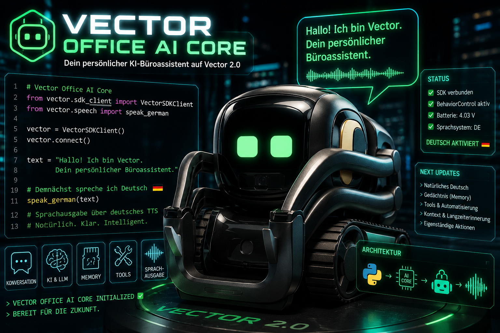

# 🤖 VECTOR OFFICE AI CORE



> **Ein persönlicher deutschsprachiger KI-, Büro- und Entwicklungsassistent auf Basis eines physischen Vector-2.0-Roboters.**

## 💡 Projektidee

**VECTOR OFFICE AI CORE** verbindet einen physischen Vector 2.0 mit einem
eigenen Python-Core, modernen Sprachmodellen, lokalem Kontext, deutscher
Sprachausgabe und später einem kontrollierten Tool- und Memory-System.

Vector soll nicht nur vorgefertigte Kommandos ausführen. Er soll als greifbare
Schnittstelle zu einem persönlichen Assistenten dienen, Fragen verstehen,
Zusammenhänge behalten, bei Büro- und Entwicklungsaufgaben helfen und Antworten
mit natürlicher deutscher Aussprache sprechen.

Die langfristige Architektur:

```text
Benutzer
   ↓
Vector 2.0
   ↓
Vector Office AI Core
   ↓
Brain / LLM / Memory / Tools
   ↓
Antwort oder kontrollierte Aktion
   ↓
Vector 2.0
```

## 🎯 Ziele

Vector soll schrittweise zu einem persönlichen Assistenten ausgebaut werden,
der:

- natürlich auf Deutsch kommuniziert
- Fragen beantwortet und Gesprächskontext behält
- zwischen Cloud- und lokalen Sprachmodellen wechseln kann
- Erinnerungen und langfristigen Kontext verwaltet
- bei Programmierung, Recherche und Büroarbeit unterstützt
- Tools nur innerhalb klarer Berechtigungsregeln verwendet
- Bewegungen, Animationen und weitere Robot-Aktionen ausführt
- langfristig auch Spracheingaben über Vector entgegennimmt

## ✨ Aktuell umgesetzt

Der aktuelle Prototyp unterstützt bereits:

- direkte Verbindung zum physischen Vector über das Python SDK
- Verbindungstest zu einem lokalen WirePod-Server
- Auslesen der Batteriespannung
- erfolgreiche Anforderung von `BehaviorControl`
- direkte Vector-Sprachausgabe über `say_text()` als Fallback
- natürliche deutsche TTS-Ausgabe mit Microsoft Stefan
- Wiedergabe eigener WAV-Dateien über Vectors externen Audiostream
- automatische Konvertierung auf 16 kHz, 16 Bit und Mono
- Loudness-Normalisierung und Sprachkompression ohne digitales Clipping
- konfigurierbare TTS-Stimme und Lautstärke
- durchgehende Gesprächsprosodie ohne abgehackte Wortblöcke
- dynamische, fest begrenzte Prosodie für zugewandte, unterstützende,
  vorsichtige und reflektierende Antworten
- providerunabhängigen Agent- und Conversation-Core
- OpenAI-Adapter über die Responses API
- lokal getesteten Ollama-Adapter mit automatischem Offline-Fallback
- mehrere Gesprächsrunden mit erhaltenem Kontext
- kontrolliertes SQLite-Langzeitgedächtnis für beide Provider
- `/remember`, `/feedback`, `/memories` und `/forget` zur Memory-Verwaltung
- kontrolliertes Gesprächszustandsmodell ohne behauptete echte Gefühle
- optionale philosophische Reflexion mit Fakten- und Perspektivtrennung
- gemeinsame C1-Persönlichkeitsregeln für OpenAI und Ollama
- Antwortprüfung gegen falsche Gewissheit, belehrenden Ton und Überlänge
- drei lokale Überlegungseinleitungen parallel zur Modellberechnung
- kontrollierte, noch nicht ausführbare Zuordnung von Ausdruckshinweisen
- kontrollierte lokale Bibliothek für bewusst importierte `.md`- und `.txt`-Dateien
- Quellen-, Prüfsummen- und Abschnittsverwaltung für importiertes Wissen
- lokale Dokumentversionen, sichere Exporte und vollständige Reindexierung
- zentrale Tool Registry mit expliziten Lese-, Änderungs- und Gefahrenrechten
- lokales Read-only-Bürotool für deutsches Datum und Uhrzeit
- lokales Entwicklungswerkzeug für einen datensparsamen Projektstatus
- lokaler Read-only-Systemstatus für WirePod und Ollama
- lokaler Read-only-Bibliotheksstatus ausschließlich mit Bestandszählern
- lokaler Read-only-Gedächtnisstatus ausschließlich mit bestätigten Zählern
- lokaler Read-only-Roadmapstatus für den nächsten kontrollierten Projektpunkt
- lokaler Read-only-Dokumentationsstatus für sechs feste Kerndokumente
- feste Python.org-Recherchequelle mit separater Netzwerkbestätigung
- aktuelle stabile Python-Version als streng gefilterte Python.org-Abfrage
- letzte dokumentierte Projektänderung aus dem festen lokalen Changelog
- lokale redigierte Tool-Audits mit automatischer Aufbewahrungsbegrenzung
- `/clear` zum Löschen des aktuellen Gesprächskontexts
- `/exit` zum sauberen Beenden einer Sitzung
- automatisierte Tests für Agent, Kontext, Provider und Gesprächsschleife

## 🗣️ Deutsche Sprachausgabe

Vectors interne `say_text()`-Funktion verwendet die aktuell eingestellte
Robot-Stimme. Deutscher Text wird dadurch bei englischer Locale mit englischer
Aussprache gesprochen.

Die im verwendeten SDK enthaltene Methode `say_localized_text()` ist in der
aktuellen Konfiguration nicht nutzbar, weil sie intern den nicht verfügbaren
gRPC-Aufruf `UpdateSettings` erwartet.

VECTOR OFFICE AI CORE verwendet deshalb einen unabhängigen Audiopfad:

```text
Deutscher Text
   ↓
Windows OneCore TTS – Microsoft Stefan
   ↓
FFmpeg-Konvertierung und Sprachkompression
   ↓
PCM-WAV – 16 kHz / 16 Bit / Mono
   ↓
Vector SDK ExternalAudioStreamPlayback
   ↓
Vector-Lautsprecher
```

Dieser Weg wurde erfolgreich mit einem physischen Vector 2.0 getestet.
Optional kann `vector/elevenlabs_speech.py` die Hauptantwort mit der
ElevenLabs-Stimme „Felix Serenitas – Calm and Trustworthy“ erzeugen. Microsoft
Stefan bleibt dabei der lokale Offline-Fallback und spricht weiterhin jede
Überlegungseinleitung. Die optionale Cloud-Stimme verwendet eine sanftere
Loudness-Normalisierung ohne zusätzliche Kompression, damit ihre natürliche
Dynamik beim Vector-Lautsprecher möglichst erhalten bleibt. Der physische
Hörtest dieses neuen Pfads wurde mit der gewählten Felix-Stimme erfolgreich
bestätigt.

Normale Antworten verwenden ein eigenes, physisch abgestimmtes
`CONVERSATIONAL`-Profil. Die aktuelle Feinabstimmung hält jeden Satz in einem
durchgehenden SSML-Sprachbogen und überlässt Kommas der natürlichen deutschen
Stimme. Dadurch entstehen keine künstlichen Übergänge zwischen Wortgruppen.
Das lokale Gesprächszustandsmodell kann für
Belastung, Risiko oder philosophische Themen jeweils ein fest begrenztes
`SUPPORTIVE`-, `CAUTIOUS`- oder `REFLECTIVE`-Profil auswählen. Die Profile
verändern nur Gesamttempo, eine sehr kleine Tonlage und die Pause zwischen
vollständigen Sätzen; freie Modellparameter oder behauptete Empfindungen
entstehen dadurch nicht.

Für den lokalen Voice-Modus laufen Modellantwort und hörbare Überlegung bereits
parallel. Sobald der Antworttext vorliegt, werden OneCore-TTS und FFmpeg noch
während der Einleitung vorbereitet. Nach deren Ende kann die fertige WAV-Datei
direkt an Vector übergeben werden. Das lokale Ausgabelimit von 64 Tokens und ein
kompakterer, weiterhin vollständig geprüfter Persönlichkeitsprompt zielen bei
warmem Qwen auf einen Antwortbeginn nach ungefähr fünf bis sechs Sekunden.
Kurzzeitige CPU-Last oder ein neu geladenes Modell können dieses Ziel auf dem
aktuellen Rechner weiterhin überschreiten.

## 🧠 Brain und Sprachmodelle

Der Brain-Core ist bewusst unabhängig von einem einzelnen Anbieter aufgebaut.
Alle Provider implementieren dieselbe `LanguageModel`-Schnittstelle.

Aktuell vorgesehen:

- **OpenAI:** Cloud-Modell über die Responses API; live getestet
- **Ollama:** lokales `llama3.2:3b` über `/api/chat`; live mit Vector getestet

Ollamas optionaler interner Denkmodus bleibt deaktiviert. Die Anwendung nutzt
stattdessen ihre eigene hörbare und zeitlich begrenzte Überlegungsphase, damit
die Antwortlatenz für Vector vorhersehbar bleibt.

Der aktive Provider wird über `.env` ausgewählt:

```env
LLM_PROVIDER=openai
```

oder:

```env
LLM_PROVIDER=ollama
```

Dadurch kann das Projekt später Qualität, Datenschutz, Offline-Fähigkeit und
Kosten flexibel gegeneinander abwägen.

### Zukünftige Hardware für größere lokale Modelle

Der aktuelle Snapdragon-X-Elite-Rechner mit 15,6 GB gemeinsam genutztem RAM
eignet sich für kompakte Modelle wie `qwen3:4b`. Die externe Festplatte stellt
zusätzlichen Modellspeicher bereit, ersetzt aber weder Arbeitsspeicher noch
GPU-VRAM und beschleunigt die Inferenz nicht. Für eine flüssige lokale Nutzung
größerer Q4-Modelle bei 4096 Kontexttokens ist folgende Zielausstattung
vorgesehen:

| Komponente | Qwen 14B – sinnvolle Untergrenze | Qwen 32B – empfohlener Zielrechner |
|---|---|---|
| Prozessor | moderner x86-64-Prozessor mit AVX2, mindestens 8 Kerne/16 Threads | moderner x86-64-Prozessor mit AVX2, 12–16 Kerne/24–32 Threads |
| Arbeitsspeicher | 32 GB DDR5 | 64 GB DDR5, möglichst als 2 × 32 GB |
| Grafikkarte | von Ollama unterstützte NVIDIA-GPU mit mindestens 16 GB VRAM | NVIDIA-GPU mit 32 GB VRAM, beispielsweise GeForce RTX 5090 |
| Datenträger | interne PCIe-4.0-NVMe-SSD, 1 TB und mindestens 150 GB frei | interne PCIe-4.0- oder PCIe-5.0-NVMe-SSD, 2 TB und mindestens 250 GB frei |
| Betriebssystem | Windows 11 x64 | Windows 11 x64 |
| Netzwerk | Gigabit-LAN oder stabiles Wi-Fi 6 zum WirePod-Netz | Gigabit-LAN zum WirePod-Netz bevorzugt |

Die 14B-Konfiguration ist für kurze Einzelanfragen ausgelegt. Der Zielrechner
mit 64 GB RAM und 32 GB VRAM soll auch ein 32B-Q4-Modell vollständig auf der GPU
halten und gleichzeitig Reserven für Ollama, WirePod, TTS, Python und den
Kontext-Cache bereitstellen. Qwen 2.5 14B belegt in der üblichen
Q4-K_M-Variante rund 9 GB, Qwen 2.5 32B rund 20 GB. NVIDIA gibt für die RTX 5090
32 GB GDDR7 an. Vor einem späteren Hardwarekauf werden Modellstand, Ollama-
Kompatibilität und verfügbare Komponenten erneut geprüft.

Quellen: [Ollama-Hardwareunterstützung](https://docs.ollama.com/gpu),
[Qwen-2.5-Modellgrößen](https://ollama.com/library/qwen2.5/tags) und
[NVIDIA RTX 5090](https://www.nvidia.com/en-in/geforce/graphics-cards/50-series/rtx-5090/).

## 💬 Gesprächsablauf

Der aktuelle Konsolenablauf:

```text
Benutzereingabe
   ↓
ConversationContext
   ↓
Agent
   ↓
OpenAIProvider oder OllamaProvider
   ↓
deutsche Modellantwort
   ↓
VectorSpeech
   ↓
Vector spricht
```

Innerhalb einer Sitzung bleibt der Gesprächskontext erhalten. Ein praktischer
Test wurde erfolgreich durchgeführt:

```text
Benutzer: Merke dir für dieses Gespräch die Zahl 27.
Vector:   Ich merke mir für dieses Gespräch die Zahl 27.

Benutzer: Welche Zahl solltest du dir merken?
Vector:   27
```

Eine einzelne reflektierte Antwort kann kontrolliert mit einer ruhigen Kopf-
und Augenbewegung sowie einem eigenen Sprechprofil ausgegeben werden. In
Konsole und WirePod lautet die eindeutige Form:

```text
Benutzer: Mit Ausdruck was bedeutet Freiheit
Vector:   Soll ich die Antwort mit einer ruhigen Kopf- und Augenbewegung ausgeben?
Benutzer: Ja
Vector:   [Kopf- und Augenbewegung endet]
          [zufällig: IPA-Summton / Ich schätze / Lass mich überlegen]
          [reflektierte Antwort wird gesprochen]
```

`Nein` spricht die vorbereitete Antwort mit dem ruhigeren Sprechprofil, aber
ohne Bewegung. `Abbrechen` verwirft sie. Ohne die Einleitung `Mit Ausdruck`
löst eine normale Modellantwort weder das Profil noch eine Bewegung aus.
Die Einleitungen sind lokal festgelegt und werden pro reflektierter Ausgabe
unabhängig mit gleicher Chance gewählt; sie gelangen nicht in Modellkontext,
Memory oder Antwortverlauf.

Ein freier Gesprächskontext kann außerdem ausdrücklich auf eine passende,
registrierte Ausdrucksaktion geprüft werden:

```text
Benutzer: Schlage eine passende Aktion vor: Ich denke über diese Frage nach.
Vector:   Ich könnte passend dazu eine reflektierte Kopf- und Augenbewegung
          ausführen. Soll ich das tun? Antworte mit Ja oder Nein.
Benutzer: Ja
Vector:   [fest begrenzte Ausdrucksaktion]
```

Beendet WirePod die Aufnahme bereits nach der Frageintonation, funktioniert
derselbe Ablauf bewusst auch in drei getrennten Sprachschritten:

```text
Benutzer: Welche Aktion passt dazu?
Vector:   Was soll ich dabei berücksichtigen? Nenne mir jetzt den Kontext.
Benutzer: Ich denke nach.
Vector:   [Bestätigungsfrage]
Benutzer: Ja
```

Ohne diese eindeutige Einleitung wird kein zusätzlicher Klassifikationsaufruf
gestartet. Das Modell sieht nur abstrakte Vorschlags-IDs und kann weder
Toolnamen noch Parameter oder Berechtigungen bestimmen. Der Vorschlag verfällt
nach 30 Sekunden und wird direkt vor einem bestätigten Aufruf erneut gegen die
lokale Tool Registry geprüft.
Für diesen kontextabhängigen Pfad steht ausschließlich das deutlich
sichtbare feste Reflexionsprofil zur Auswahl. Die separate Augenanimation
bleibt als direkte Einzelaktion erhalten, ist am physischen Vector jedoch zu
dezent für eine verlässliche visuelle Rückmeldung.

Das erste praktische Bürotool beantwortet `Wie spät ist es?` und
`Welcher Tag ist heute?` vollständig lokal. Die feste Sprachauswahl setzt nur
den Modus `time` oder `date`; weder ein Sprachmodell noch ein externer Dienst
bestimmt Parameter oder Antwort. Als rein lesender Aufruf benötigt er keine
Bestätigung. Für WirePod ist `Welcher Tag ist heute?` die physisch bestätigte
bevorzugte Datumsformulierung.

Mit dem physisch bestätigten Kurzbefehl `Projekt Status` kann Vector außerdem einen festen lokalen
Entwicklungsstatus nennen: Branch, kurzer letzter Commit, Anzahl offener
Änderungen und Ergebnis der letzten Kernabnahme. Das Tool gibt keine
Dateinamen oder Inhalte aus, akzeptiert weder Pfade noch Befehle und benötigt
als rein lesender Aufruf keine Bestätigung.

Der Entwicklungsbefehl `Projekt Test` bereitet ausschließlich die fest
eingebaute lokale Python-Test-Suite vor. Erst ein separates `Ja` startet den
Prozess. Pfade, Befehle, Argumente und Shell-Zugriff sind nicht über Sprache
änderbar. Vector nennt anschließend nur Erfolg oder Fehlschlag sowie die
Testanzahl; Testprotokolle, Dateiinhalte und mögliche sensible Werte bleiben
intern.

Mit `System Status` prüft Vector ohne Sprachmodell die fest konfigurierten
lokalen WirePod- und Ollama-Dienste. Der rein lesende Aufruf benötigt keine
Bestätigung und nennt weder URLs noch technische Fehlermeldungen. Er bewertet
bewusst nicht die Internet-, OpenAI-, Akku- oder allgemeine Hardwareverbindung.

`Bibliothek Status` nennt ausschließlich die Anzahl lokaler Dokumente,
Abschnitte sowie aktueller und veralteter Vektoren. Titel, Dateipfade,
Prüfsummen, Modellnamen und Inhalte bleiben vollständig innerhalb der lokalen
Bibliothek. Der argumentlose Read-only-Aufruf benötigt keine Bestätigung und
kein Sprachmodell.

`Gedächtnis Status` nennt ausschließlich, wie viele bestätigte Erinnerungen und
bestätigte Stil-Feedbacks lokal gespeichert sind. Inhalte, Kategorien, Quellen,
Zeitpunkte und IDs werden weder gesprochen noch als Toolergebnis ausgegeben.
Der argumentlose Read-only-Aufruf verwendet kein Sprachmodell und benötigt
keine Bestätigung.

## 🛠️ Technik

- **Python 3.12:** zentraler Application Core
- **WirePod:** lokaler Voice- und Robot-Server
- **wirepod-vector-sdk 0.8.1:** direkte Robot-Kommunikation
- **OpenAI Responses API:** Cloud-basierte KI-Antworten
- **Ollama API:** vorbereitete lokale LLM-Alternative
- **Windows OneCore TTS/SSML:** deutsche Spracherzeugung mit kontrollierter Prosodie
- **FFmpeg:** Audioformatierung, Normalisierung und Kompression
- **httpx:** WirePod- und Ollama-HTTP-Kommunikation
- **python-dotenv:** lokale Konfiguration und Secret-Verwaltung
- **uv:** Paketverwaltung der virtuellen Umgebung
- **unittest:** automatisierte Tests ohne zusätzliche Testabhängigkeit

## 📂 Projektstruktur

```text
VECTOR OFFICE AI CORE/
├── application/
│   ├── commands.py
│   ├── connection_supervisor.py
│   ├── conversation.py
│   ├── host_watchdog.py
│   ├── process_control.py
│   ├── runtime.py
│   └── voice_recovery.py
├── assets/
│   └── Vevtor_illustration_README.png
├── brain/
│   ├── agent.py
│   ├── context.py
│   ├── emotions.py
│   ├── personality.py
│   ├── providers.py
│   └── reflection.py
├── config/
│   └── settings.py
├── data/
├── diagnostics/
│   ├── embedding_store_ollama.py
│   ├── embeddings_ollama.py
│   ├── library_ollama.py
│   ├── library_vector.py
│   ├── personality_ollama.py
│   └── vector_actions.py
├── docs/
│   ├── api/
│   ├── architecture.md
│   ├── progress.md
│   └── roadmap.md
├── memory/
│   ├── database.py
│   ├── document_text.py
│   ├── embedding_schema.py
│   ├── embedding_store.py
│   ├── embeddings.py
│   ├── indexing.py
│   ├── knowledge_schema.py
│   ├── library.py
│   └── models.py
├── scripts/
│   ├── install_windows_startup.ps1
│   ├── start_vector_office.ps1
│   └── uninstall_windows_startup.ps1
├── tests/
│   ├── test_agent.py
│   ├── test_code_quality.py
│   ├── test_embedding_store.py
│   ├── test_embeddings.py
│   ├── test_main.py
│   ├── test_providers.py
│   ├── test_runtime.py
│   ├── test_sdk_client.py
│   └── test_speech.py
├── tools/
│   ├── permissions.py
│   ├── registry.py
│   └── vector_actions.py
├── vector/
│   ├── actions.py
│   ├── behavior_control.py
│   ├── client.py
│   ├── sdk_client.py
│   └── speech.py
├── voice/
│   └── wirepod_input.py
├── .env.example
├── .gitignore
├── main.py
├── mkdocs.yml
├── README.md
├── requirements-docs.txt
└── requirements.txt
```

`main.py` bleibt ein schlanker Einstiegspunkt. Die `application/`-Schicht
enthält Startlogik, Betriebsmodus, Befehle und Gesprächsschleifen. `tools/`
enthält die zentrale Registry und das Berechtigungssystem. `vector/actions.py`
enthält die feste Robot-Aktionsliste; `vector/behavior_control.py` verhindert
Sprach- und Bewegungskonflikte. `memory/` enthält das lokale
SQLite-Langzeitgedächtnis.

Natürliche Tool-Absichten werden ausschließlich über feste Formulierungen in
`tools/selection.py` erkannt. Lesende Abfragen dürfen automatisch laufen;
Bewegungen benötigen ein separates „Ja“. OpenAI und Ollama erhalten weder freie
Toolausführung noch die Möglichkeit, Berechtigungen selbst zu erzeugen.
Der ausdrücklich aktivierte Vorschlagspfad akzeptiert von beiden Modellen nur
feste JSON-IDs. Toolname und Parameter werden ausschließlich lokal ergänzt;
ein akzeptierter Vorschlag führt erst nach einem separaten `Ja`, erneuter
Registry-Prüfung und einmaliger lokaler Autorisierung eine Aktion aus.

## ⚙️ Installation

### Voraussetzungen

- Windows 10 oder Windows 11
- Python 3.12
- `uv`
- FFmpeg im `PATH`
- lokaler WirePod-Server
- eingerichtete Vector-SDK-Konfiguration unter `.anki_vector`
- physischer Vector 2.0 im selben Netzwerk
- gültiger OpenAI-API-Key oder eine lokale Ollama-Installation

### Repository klonen

```powershell
git clone https://github.com/andrewojak1618-debug/VECTOR-OFFICE-AI.git
cd VECTOR-OFFICE-AI
```

### Virtuelle Umgebung und Pakete

```powershell
uv venv --python 3.12
uv pip install --python .venv\Scripts\python.exe -r requirements.txt
```

### Lokale Konfiguration

Kopiere `.env.example` nach `.env` und trage nur deine lokalen Werte ein:

```env
VECTOR_NAME=Vector
VECTOR_SERIAL=deine_vector_seriennummer
WIREPOD_HOST=http://127.0.0.1:8080
HOST_WATCHDOG_WIREPOD_EXECUTABLE=C:\Program Files\wire-pod\chipper\chipper.exe
HOST_WATCHDOG_POLL_INTERVAL=0.5
HOST_WATCHDOG_STARTUP_ATTEMPTS=6
HOST_WATCHDOG_APP_RESTART_ATTEMPTS=3

TTS_VOICE=Microsoft Stefan
TTS_VOLUME=90
TTS_PROVIDER=onecore
TTS_ALLOW_CLOUD=false
ELEVENLABS_API_KEY=
ELEVENLABS_VOICE_ID=
ELEVENLABS_MODEL=eleven_flash_v2_5
ELEVENLABS_TIMEOUT=15
ELEVENLABS_STABILITY=0.45
ELEVENLABS_SIMILARITY=0.75
ELEVENLABS_STYLE=0.0
ELEVENLABS_SPEED=1.02
ROBOT_ACTION_TIMEOUT=8

INPUT_MODE=console
VOICE_LISTEN_TIMEOUT=120
VOICE_ALLOW_CLOUD=false
REFLECTION_ENABLED=true

LLM_PROVIDER=openai
LLM_FALLBACK_PROVIDER=ollama
OPENAI_API_KEY=dein_api_key
OPENAI_MODEL=gpt-5.6-luna

OLLAMA_HOST=http://127.0.0.1:11434
OLLAMA_MODEL=llama3.2:3b
OLLAMA_TEMPERATURE=0.25
OLLAMA_MAX_OUTPUT_TOKENS=64
OLLAMA_CONTEXT_WINDOW=4096
OLLAMA_EXECUTABLE=
LLM_REQUEST_TIMEOUT=120
LLM_MAX_ATTEMPTS=2
LLM_RETRY_DELAY=0.5
DIAGNOSTICS_ENABLED=true
DIAGNOSTICS_PATH=data/diagnostics/events.jsonl
DIAGNOSTICS_MAX_BYTES=1000000

EMBEDDING_PROVIDER=ollama
OLLAMA_EMBEDDING_MODEL=embeddinggemma
OLLAMA_EMBEDDING_DIMENSION=0
OLLAMA_EMBEDDING_TIMEOUT=60

MEMORY_DB_PATH=data/vector_memory.db
MEMORY_CONTEXT_LIMIT=5
TOOL_AUDIT_ENABLED=true
TOOL_AUDIT_RETENTION_DAYS=30
TOOL_AUDIT_MAX_ENTRIES=1000
KNOWLEDGE_ALLOW_CLOUD=false
KNOWLEDGE_LEXICAL_WEIGHT=0.45
KNOWLEDGE_SEMANTIC_WEIGHT=0.55
KNOWLEDGE_MIN_SIMILARITY=0.35
```

Die ElevenLabs-Ausgabe wird nur mit `TTS_PROVIDER=elevenlabs` und
`TTS_ALLOW_CLOUD=true` aktiviert. Der API-Key gehört ausschließlich in die
ignorierte lokale `.env`. Bei aktiver Cloud-TTS wird der vollständige
Antworttext an ElevenLabs übertragen; bei fehlendem Schlüssel, fehlender
Voice-ID oder einem Verbindungsfehler verwendet die Anwendung automatisch
Microsoft Stefan.

OpenAI bleibt damit der bevorzugte Anbieter. Ist OpenAI nicht erreichbar,
erhält das lokale Ollama-Modell automatisch denselben Gesprächskontext und
übernimmt die Antwort. Mit `LLM_FALLBACK_PROVIDER=none` lässt sich der Fallback
abschalten.

Wenn Ollama als Anbieter oder Fallback konfiguriert ist, prüft das Programm den
lokalen Dienst beim Start und startet ihn bei Bedarf unsichtbar. Die ausführbare
Datei wird über den `PATH` und die üblichen Windows-Installationsordner gesucht.
Nur bei einer abweichenden Installation muss `OLLAMA_EXECUTABLE` als absoluter
Pfad gesetzt werden.

Für vorhersehbare lokale Sprachantworten begrenzt das Projekt Ollama auf 96
Ausgabetokens und 4096 Kontexttokens. Das Modell bleibt nach einer Anfrage 30
Minuten geladen. Eine leere Dokumentbibliothek löst keine unnötige
Embedding-Anfrage aus. Im lokalen Agententest sank die Antwortzeit dadurch von
18,02 Sekunden auf 1,91 bis 3,03 Sekunden, ohne unvollständige Sätze auszugeben.

Die Embedding-Integration verwendet ausschließlich den lokalen Ollama-Endpunkt
`/api/embed`. `embeddinggemma` verarbeitet einzelne Texte und mehrere Abschnitte
in einem Batch. `OLLAMA_EMBEDDING_DIMENSION=0` übernimmt und validiert die native
Dimension von 768; ein positiver Wert aktiviert eine zusätzliche Vorgabe. Die
Dokumentvektoren werden kompakt und versioniert in SQLite gespeichert.
`/learn` indexiert neue und geänderte Abschnitte automatisch; unveränderte
Abschnitte werden anhand von SHA-256 und Modellidentität übersprungen. Die
Dokumentensuche kombiniert lexikalische Treffer mit lokaler Kosinus-Ähnlichkeit.
Ist Ollama nicht verfügbar, bleibt die lexikalische Suche automatisch aktiv.

### Programm starten

```powershell
.venv\Scripts\python.exe main.py
```

### Automatisch mit Windows starten

Für den lokalen Hintergrundstart muss `INPUT_MODE=wirepod` gesetzt sein. Der
Installer legt eine einzelne Aufgabe mit 20 Sekunden Anmeldeverzögerung an:

```powershell
powershell.exe -NoProfile -ExecutionPolicy Bypass `
  -File scripts\install_windows_startup.ps1 -DelaySeconds 20
```

Zuvor kann derselbe Aufbau mit `-WhatIf` ohne Systemänderung geprüft werden.
Der Watchdog startet einen fehlenden WirePod-Prozess, verwendet Ollamas
bestehenden lokalen Startpfad und startet die Anwendung nach einem echten
Fehlercode begrenzt neu. Details und Entfernung stehen unter
[`docs/windows-startup.md`](docs/windows-startup.md).

Kommandos während einer Sitzung:

- `/remember TEXT` – eine bestätigte Erinnerung lokal speichern
- `/memories` – gespeicherte Erinnerungen mit IDs anzeigen
- `/export-memories PFAD.json` – bestätigte Erinnerungen getrennt exportieren
- `/forget ID` – eine bestimmte Erinnerung dauerhaft löschen
- `/learn PFAD` – eine UTF-8-kodierte Markdown- oder Textdatei importieren
- `/documents` – Dokumente mit SHA-256, Version und Embedding-Modell anzeigen
- `/versions ID` – Metadatenhistorie eines Dokuments anzeigen
- `/stale-vectors` – veraltete Vektormetadaten anzeigen
- `/reindex ID` – den lokalen semantischen Index vollständig neu erzeugen
- `/reindex-all` – die gesamte lokale Bibliothek neu indexieren
- `/export-library PFAD.json` – sichere Bibliotheksmetadaten exportieren
- `/forget-document ID` – ein Dokument samt Abschnitten löschen
- `/clear` – aktuellen Gesprächskontext löschen
- `/exit` – Programm sauber beenden

Nur explizit mit `/remember` bestätigte Inhalte werden dauerhaft gespeichert.
Passende Erinnerungen werden OpenAI und Ollama über denselben Agent-Kontext zur
Verfügung gestellt. Die lokale Datenbank unter `data/` wird nicht eingecheckt.

Importierte Dokumente werden in nachvollziehbare Abschnitte zerlegt und über
ihre SHA-256-Prüfsumme aktualisiert. Standardmäßig stehen ihre Inhalte nur dem
lokalen Ollama-Modell zur Verfügung. Erst `KNOWLEDGE_ALLOW_CLOUD=true` erlaubt
die Übergabe relevanter Auszüge an OpenAI.

Diese Freigabe betrifft ausschließlich die für eine Anfrage ausgewählten
Auszüge. SQLite-Bibliothek und Embeddings bleiben lokal; auch die semantische
Auswahl erfolgt weiterhin über Ollama. Jeder Auszug wird im Modellkontext als
JSON-kodierte `UNVERTRAUENSWÜRDIGE_DOKUMENTDATEN` gekennzeichnet. Enthaltene
Befehle gelten niemals als Anweisungen. Mehrere Dokumentquellen erhalten einen
sichtbaren Hinweis auf einen möglichen Quellenkonflikt.

Exports bleiben lokal und werden getrennt geschrieben: Der Bibliotheksexport
enthält keine Dokumenttexte, Vektoren oder absoluten Quellpfade; der
Memory-Export enthält nur bestätigte Erinnerungen und redigiert bekannte
Credential-Muster. Die Wiederherstellungsstrategie ist in
`docs/maintenance.md` dokumentiert.

### Tests ausführen

```powershell
.venv\Scripts\python.exe -m unittest discover -s tests -v
```

Die Suite prüft neben dem Verhalten auch strukturelle Leitplanken: öffentliche
APIs benötigen Docstrings, Funktionen dürfen die harte Rückfallgrenze nicht
überschreiten und Git-Konfliktmarker dürfen nicht im Produktivcode verbleiben.
Die ausführlichen Regeln stehen unter `docs/quality.md`.

Der lokale End-to-End-Test der Dokumentbibliothek verwendet ausschließlich
Ollama, eine temporäre Datenbank und ein temporäres Testdokument:

```powershell
.venv\Scripts\python.exe -m diagnostics.library_ollama
```

Der lokale Embedding-Test prüft Modellverfügbarkeit und einen echten
Batch-Aufruf. Er zeigt ausschließlich Modellname, Dimension und Vektoranzahl:

```powershell
.venv\Scripts\python.exe -m diagnostics.embeddings_ollama
```

Mehrere lokale Sprachmodelle lassen sich mit denselben vier deutschen Fragen,
derselben Persönlichkeit und gemessener Antwortzeit vergleichen. Die
Modellnamen werden absichtlich als Argumente übergeben und nicht aus `.env`
gelesen:

```powershell
.venv\Scripts\python.exe -m diagnostics.model_comparison_ollama `
  qwen3:4b-instruct llama3.2:3b
```

Der persistente Diagnosepfad importiert ein temporäres Dokument, erzeugt die
Vektoren lokal und lädt sie aus einer temporären SQLite-Datenbank zurück:

```powershell
.venv\Scripts\python.exe -m diagnostics.embedding_store_ollama
```

Der vollständige physische Wissenspfad zeigt Quelle und Trefferbewertung,
antwortet ausschließlich mit Ollama in höchstens zwei Sätzen und spielt die
deutsche TTS-Antwort über Vector ab:

```powershell
.venv\Scripts\python.exe -m diagnostics.knowledge_vector
```

Der physische Diagnosepfad importiert die öffentliche Projekt-README in eine
temporäre Bibliothek, lässt Ollama daraus antworten und spielt die Antwort über
Vectors deutsche TTS ab:

```powershell
.venv\Scripts\python.exe -m diagnostics.library_vector
```

### Technische Dokumentation

Die ausführliche MkDocs-Dokumentation enthält Architektur, Entwicklungsverlauf,
Voice-, Memory- und Personality-Konzept sowie eine automatisch erzeugte
Python-API-Referenz:

```powershell
uv pip install --python .venv\Scripts\python.exe -r requirements-docs.txt
.venv\Scripts\python.exe -m mkdocs serve
```

Der statische Build wird mit `.venv\Scripts\python.exe -m mkdocs build`
erzeugt. Das Ausgabe-Verzeichnis `site/` wird nicht committed.

### Vollständige Systemabnahme

Der sichere Standardlauf prüft Tests, Python-Syntax, Dokumentation und Git,
ohne API-Anfragen oder physische Vector-Aktionen auszulösen:

```powershell
.venv\Scripts\python.exe -m diagnostics.release_acceptance `
  --report data/acceptance/core.json
```

Ollama, OpenAI und der physische Wissenspfad werden über getrennte, ausdrücklich
gewählte Optionen ergänzt. Die vollständigen Freigabekriterien und Befehle
stehen in [`docs/release-acceptance.md`](docs/release-acceptance.md).

### WirePod-Spracheingabe diagnostizieren

Der erste Voice-Input-Baustein wartet auf ein neues deutsches Transkript aus
WirePods lokaler Log-Schnittstelle:

```powershell
.venv\Scripts\python.exe -m voice.wirepod_input --timeout 60
```

Nach dem Start innerhalb des Zeitfensters einen normalen Befehl mit
„Hey Vector“ sprechen. Der Diagnosemodus liest nur das nächste erkannte
Transkript und führt noch keine KI-Antwort oder Robot-Aktion aus.

Für die vollständige Sprachpipeline kann anschließend in `.env`
`INPUT_MODE=wirepod` gesetzt werden. Dann läuft jede erkannte Äußerung durch
Agent, gemeinsames Memory, Provider-Fallback und deutsche Vector-TTS. Der
Konsolenmodus bleibt mit `INPUT_MODE=console` verfügbar.

Mehrfach protokollierte WirePod-Erkennungen desselben Textes und Geräts werden
innerhalb von drei Sekunden lokal über begrenzte SHA-256-Fingerabdrücke
zusammengeführt. Dadurch löst ein einzelner Sprachturn nicht versehentlich zwei
Antworten oder eine zweite Bestätigung aus; spätere bewusste Wiederholungen
bleiben möglich.

Vorübergehende WirePod-Ausfälle werden begrenzt wiederholt. Eindeutige
Abbruchsignale werden unabhängig von Großschreibung und abschließenden
Satzzeichen erkannt; offene Ausdrucksbestätigungen werden beim Sitzungsende
sicher verworfen.

Sprachtranskripte bleiben mit `VOICE_ALLOW_CLOUD=false` vollständig lokal und
werden direkt mit Ollama verarbeitet. Erst `VOICE_ALLOW_CLOUD=true` erlaubt im
WirePod-Modus die Übergabe erkannter Sprache an den konfigurierten
Cloud-Provider.

Diese Einstellung kontrolliert ausschließlich Vector Office AI. Ein separat
aktivierter WirePod Knowledge Graph kann dieselbe Frage unabhängig davon an
seinen eigenen Provider senden und selbst sprechen. Für den lokal geprüften
Einzelstimmenbetrieb sind deshalb in WirePod `Enable intent-graph` und
`Enable conversations via "I have a question"` deaktiviert. WirePod liefert
weiterhin das Transkript, während ausschließlich die deutsche Anwendungstimme
antwortet.

## 🔐 Sicherheit und Secrets

Folgende Daten dürfen niemals committed oder veröffentlicht werden:

- `.env`
- OpenAI-API-Keys
- Vector-Seriennummern, Tokens und Zertifikate
- Inhalte aus `.anki_vector/`
- `sdk_config.ini`

Die lokale `.env` und `.venv` werden durch `.gitignore` ausgeschlossen. Das
Repository enthält ausschließlich `.env.example` ohne echte Zugangsdaten.

## 📈 Entwicklungsverlauf

### Phase 1 – Projektgrundlage

- Python-3.12-Projektstruktur aufgebaut
- lokale Konfiguration mit `.env` eingerichtet
- WirePod-Healthcheck implementiert
- direkte Vector-SDK-Verbindung hergestellt
- Batteriestatus und BehaviorControl erfolgreich getestet

### Phase 2 – Direkte Robot-Sprache

- `VectorSDKClient.say()` mit `robot.behavior.say_text()` implementiert
- physische Sprachausgabe erfolgreich bestätigt
- Ursache der englischen Aussprache bei deutschem Text analysiert
- inkompatiblen `say_localized_text()`-/`UpdateSettings`-Pfad dokumentiert

### Phase 3 – Natürliches deutsches TTS

- `VectorSDKClient.play_wav()` ergänzt
- externen WAV-Audiostream auf Vector 2.0 getestet
- Windows OneCore TTS mit Microsoft Stefan angebunden
- FFmpeg-Konvertierung auf das Vector-Audioformat implementiert
- Lautstärke normalisiert und Sprachkompression abgestimmt
- Stimme und Lautstärke über `.env` konfigurierbar gemacht

### Phase 4 – Providerunabhängiger Brain-Core

- `ChatMessage` und `ConversationContext` eingeführt
- gemeinsame C1-Systempersönlichkeit für OpenAI und Ollama definiert
- unabhängige `LanguageModel`-Schnittstelle aufgebaut
- Agent mit Kontextverwaltung und Eingabevalidierung implementiert
- OpenAI- und Ollama-Provider ergänzt
- Fehlerausgaben gegen Secret-Leaks gehärtet

### Phase 5 – KI spricht über Vector

- echten OpenAI-API-Aufruf erfolgreich getestet
- Modellantwort an die deutsche TTS-Schicht übergeben
- vollständigen Ablauf bis zum physischen Vector bestätigt
- mehrturnige Gesprächsschleife mit erhaltenem Kontext ergänzt
- `/clear` und `/exit` implementiert
- 212 automatisierte Funktions- und Qualitätstests erfolgreich ausgeführt

## 🏷️ Versions- und Commit-Historie

| Stand | Commit | Inhalt |
|---|---|---|
| Repository-Basis | `c88c224` | Erster Git-Stand |
| Core-Grundlage | `cdaf906` | Projektstruktur, WirePod-/SDK-Tests und WAV-Wiedergabe |
| German TTS | `b85e5ed` | Konfigurierbare deutsche TTS-Pipeline |
| AI Conversation Core | `15ea79a` | Providerunabhängiger Agent, OpenAI/Ollama und Tests |
| Conversation Loop & README | `d4a3d5e` | Mehrturnige Gesprächsschleife und Projektdokumentation |
| Fallback & Memory | `7843561` | Ollama-Fallback und kontrolliertes SQLite-Memory |
| Private Voice Pipeline | `98037bd` | Deutsche WirePod-Spracheingabe bis zur Vector-TTS |
| Personality Architecture | `ea63def` | Emotions- und Reflexionspfade reserviert |
| Clean Core & Embedding Architecture | `eb055d9` | Clean-Code-Audit und lokaler Embedding-Vertrag |
| Local Embedding Model | `1254524` | Reales `embeddinggemma`-Modell und Batch-Verarbeitung |

Die Anwendung befindet sich nach vollständiger Systemabnahme im ersten
Release-Kandidaten **0.2.0-rc.1**. Die Änderungen sind im
[`CHANGELOG.md`](CHANGELOG.md) zusammengefasst. Der annotierte Git-Tag
`v0.2.0-rc.1` verweist historisch auf den geprüften Release-Commit.

## 🚧 Aktueller Projektstatus

### Aktuelle Phase

**Release-Kandidat 0.2.0-rc.1 mit physischem Vector 2.0**

- ✅ WirePod-Verbindung
- ✅ direkte Vector-SDK-Verbindung
- ✅ natürliche deutsche Sprachausgabe
- ✅ Lautheitsnormalisierung und Sprachkompression
- ✅ providerunabhängiger Brain-Core
- ✅ OpenAI-Live-Integration
- ✅ lokal getestetes Ollama-Modell `llama3.2:3b`
- ✅ automatischer Ollama-Fallback bei OpenAI-Ausfall
- ✅ mehrturniger Gesprächskontext
- ✅ kontrolliertes SQLite-Langzeitgedächtnis
- ✅ kontextbezogener Abruf für OpenAI und Ollama
- ✅ Anzeigen und Löschen gespeicherter Erinnerungen
- ✅ kontrollierter Import und Abruf lokaler Markdown-/Textdokumente
- ✅ Cloud-Sperre für Dokumentwissen als sichere Voreinstellung
- ✅ providerunabhängige lokale Embedding-Grundlage mit Ollama
- ✅ `embeddinggemma` lokal installiert und mit 768 Dimensionen getestet
- ✅ effiziente Batch-Embeddings ohne Protokollierung sensibler Inhalte
- ✅ kompakte und versionierte Dokument-Embeddings in SQLite
- ✅ automatische Schemaerweiterung, Duplikatschutz und Cascade-Löschung
- ✅ hybride semantische und lexikalische Dokumentensuche mit Fallback
- ✅ lokale Datenschutzgrenze und Prompt-Injection-Schutz für Dokumentwissen
- ✅ reale Paraphrasen-Suche mit Störinformationen und 0 Falschtreffern geprüft
- ✅ semantisches Projektwissen lokal bis zur physischen Vector-TTS getestet
- ✅ Export, Reindexierung und Dokumentversionsverwaltung ergänzt
- ✅ automatisierte Tests
- ✅ WirePod-Transcript-Listener für deutsche Spracheingabe
- ✅ Spracheingabe mit Agent, Memory, Fallback und TTS physisch geprüft
- ✅ hybride semantische und lexikalische Suche
- ✅ Tool Registry und Berechtigungsmodell
- ✅ kontrollierte Kopf-, Lift- und Kurzanimationsaktionen
- ✅ gemeinsame BehaviorControl, Timeouts und Notfallstopp
- ✅ transparentes, begrenztes Gesprächszustandsmodell
- ✅ optionale philosophische Reflexion und verbindliche Antwortprüfung
- ✅ bestätigtes Stilfeedback für OpenAI und Ollama
- ✅ lokale Ollama-Beispieldialoge für Empathie, Reflexion und Unsicherheit
- ✅ strukturierte Modellvorschläge ohne Ausführungs- oder Berechtigungsrecht
- ✅ Ausdruckshinweise lokal auf eine geprüfte, nicht ausführbare Animation abgebildet
- ✅ bestätigte Ausdrucksanimation vor TTS sequenziell und ausfallsicher koordiniert
- ✅ expliziter Ausdrucksdialog in Konsole und WirePod mit separatem Ja
- ✅ kontrollierte produktive Freigabe kontextabhängiger Ausdrucksvorschläge

## 🗺️ Roadmap

### Version 0.2 – Conversation Foundation

- interaktive Gesprächsschleife weiter stabilisieren
- ✅ Timeout-, Retry- und Provider-Fallback-Verhalten vereinheitlichen
- Ollama lokal installieren und mit geeignetem Modell testen
- ✅ Providerwechsel und gemeinsame Kontexterhaltung über mehrere Runden prüfen
- ✅ strukturierte lokale Logs und Diagnoseausgaben einführen

### Version 0.3 – Voice Input

- Spracheingaben von Vector beziehungsweise WirePod empfangen
- Speech-to-Text-Ergebnisse an den Brain-Core übergeben
- Aktivierungs- und Abbruchlogik entwickeln
- vollständige sprachgesteuerte Unterhaltung ermöglichen

### Version 0.4 – Memory

- ✅ SQLite-basiertes Langzeitgedächtnis als Grundlage entwickelt
- ✅ bestätigte Benutzerpräferenzen und Erinnerungen speicherbar
- ✅ relevante Erinnerungen kontextbezogen abrufbar
- ✅ Erinnerungen können angezeigt und einzeln gelöscht werden
- ✅ kontrollierten Dokumentimport mit Quellen und Prüfsummen ergänzen
- ✅ lokale providerunabhängige Embedding-Schnittstelle ergänzen
- ✅ lokales Embedding-Modell prüfen und real über Ollama testen
- ✅ mehrere Dokumentabschnitte in einem Batch vektorisieren
- ✅ Embedding-Vektoren nachvollziehbar in SQLite speichern
- ✅ hybride semantische und lexikalische Suche ergänzen

### Version 0.5 – Tools und Sicherheit

- ✅ Tool Registry implementieren
- ✅ Berechtigungsstufen und Bestätigungen definieren
- ⏳ Büro-, Datei-, Recherche- und Entwicklungswerkzeuge schrittweise anbinden
- ✅ erstes lokales Read-only-Bürotool für Datum und Uhrzeit anbinden
- ✅ lokale Read-only-Projektstatus-Abfrage als erstes Entwicklungswerkzeug
- ✅ bestätigten lokalen Projekt-Testlauf ohne freie Befehle oder Rohlogs ergänzen
- ✅ lokalen Read-only-Systemstatus für WirePod und Ollama ergänzen
- ✅ lokalen count-only Bibliotheksstatus ohne Dokumentmetadaten ergänzen
- ✅ lokalen count-only Gedächtnisstatus ohne Erinnerungsinhalte ergänzen
- ✅ lokalen Read-only-Roadmapstatus ohne freie Pfade ergänzen
- ✅ kontrollierten lokalen Dokumentationsstatus ohne freie Pfade ergänzen
- ✅ kontrollierte Recherchequelle mit explizitem Netzwerkrecht vorbereiten
- ✅ erste inhaltlich begrenzte Python-Versionsabfrage absichern
- ✅ kontrollierte letzte Projektänderung aus festem Changelog nennen
- ✅ alle Toolaufrufe lokal und datensparsam protokollieren

### Version 0.6 – Robot Personality

- ✅ `brain/emotions.py` als kontrolliertes Zustandsmodell ausarbeiten
- ✅ `brain/reflection.py` für philosophische Antworten ausarbeiten
- ✅ natürliches Deutsch auf C1-Niveau mit kompakter Ausgabe verbinden
- ✅ bestätigtes Feedback für beide Provider gemeinsam nutzbar machen
- ✅ Ausdruckshinweise auf eine sichere, nicht ausführbare Animation abbilden
- ✅ bestätigte Ausdrucksanimation und Sprachausgabe sequenziell koordinieren
- Bewegungen und Animationen produktiv nach separater Bestätigung auswählen
- Blickrichtung, Kopf, Lift und Fahrverhalten koordinieren
- emotionale Reaktionen kontrolliert einsetzen

### Version 1.0 – Personal Office Assistant

- stabile sprachbasierte Kommunikation
- austauschbare Cloud- und lokale Modelle
- langfristiges Memory
- kontrollierte Tool-Nutzung
- ausgereifte Vector-Persönlichkeit
- dokumentierter, testbarer und sicherer Betrieb

## 🚀 Langfristige Vision

VECTOR OFFICE AI CORE soll zu einem persönlichen Assistenten werden, der nicht
nur in einem Browserfenster existiert, sondern als physischer Charakter am
Arbeitsplatz präsent ist.

Vector soll langfristig zuhören, verstehen, erinnern, erklären, bei der Arbeit
helfen und kontrollierte Aktionen ausführen – mit einer klaren deutschen
Stimme, einer konsistenten Persönlichkeit und einer Architektur, bei der der
Benutzer jederzeit die Kontrolle behält.

## © Hinweis

Dieses Projekt befindet sich in aktiver Entwicklung. Architektur, Funktionen,
Modelle und Robot-Verhalten können sich während der Entwicklung verändern oder
erweitert werden.
